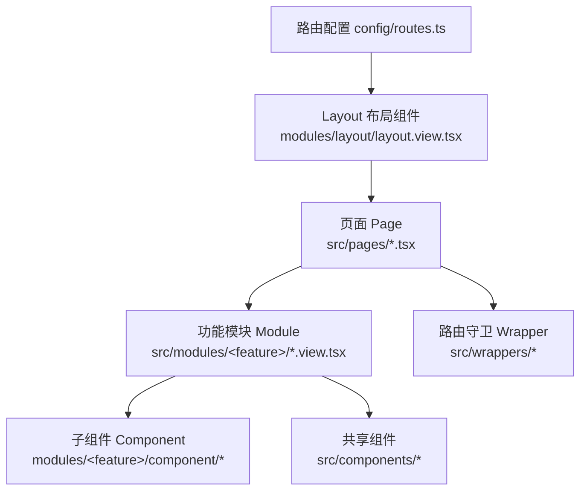
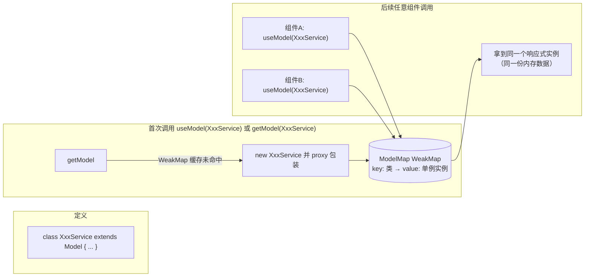
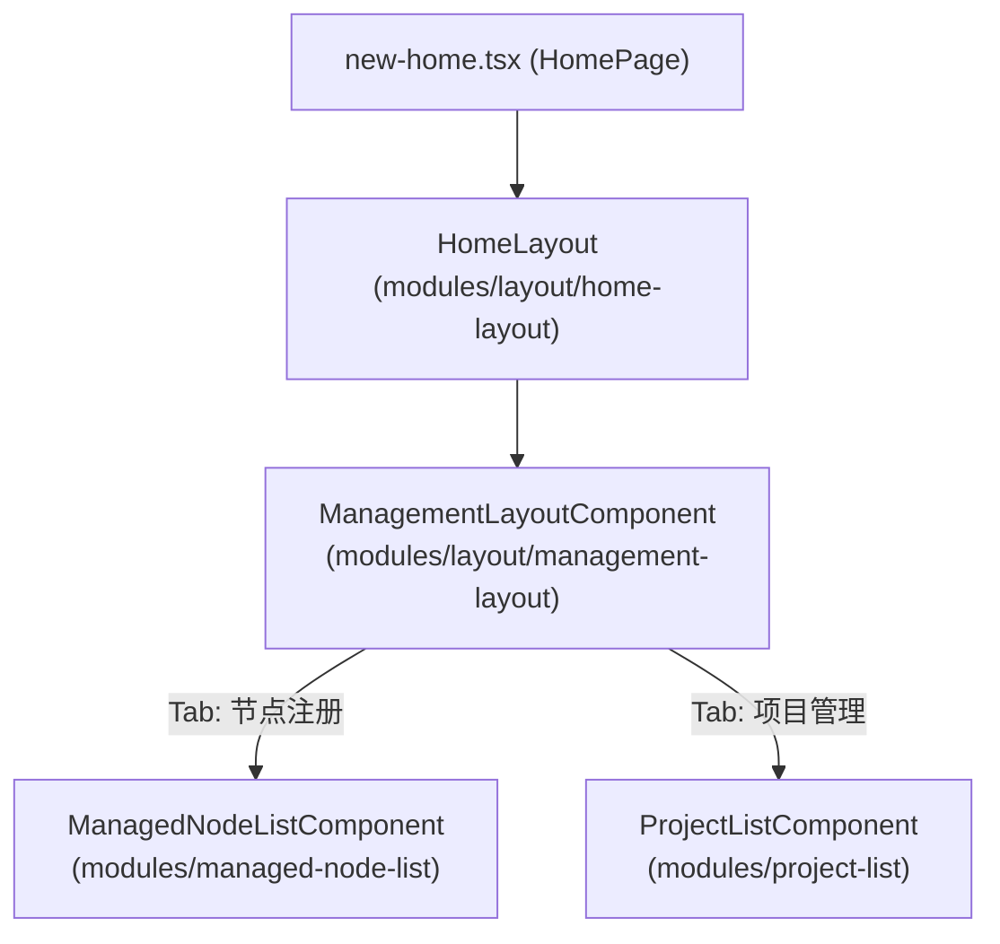
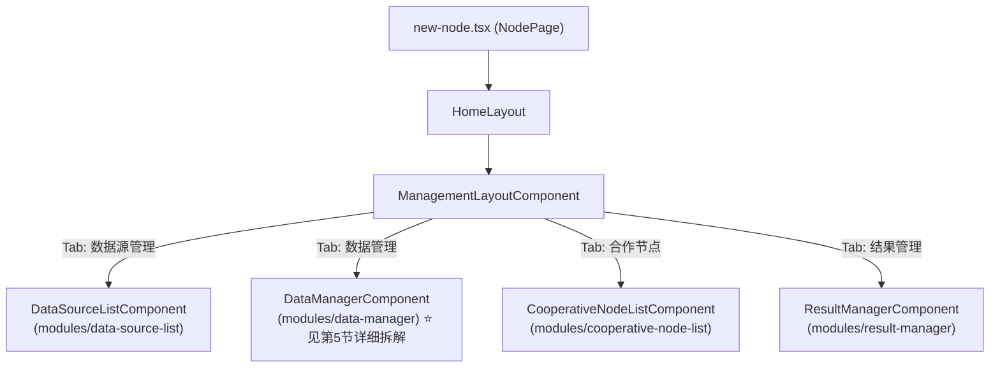
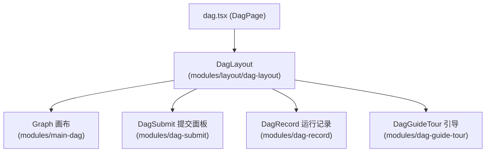
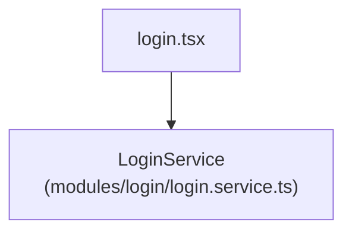
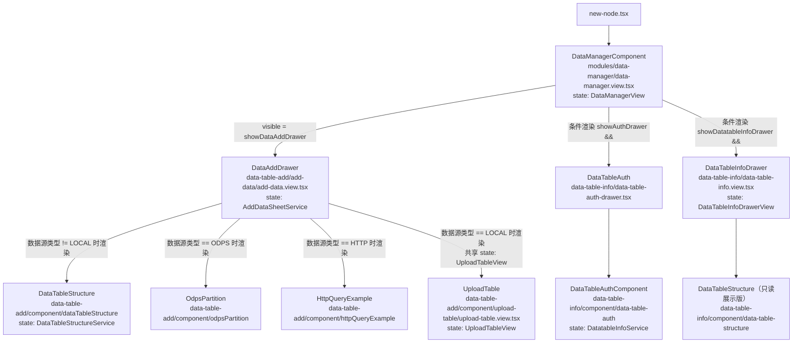
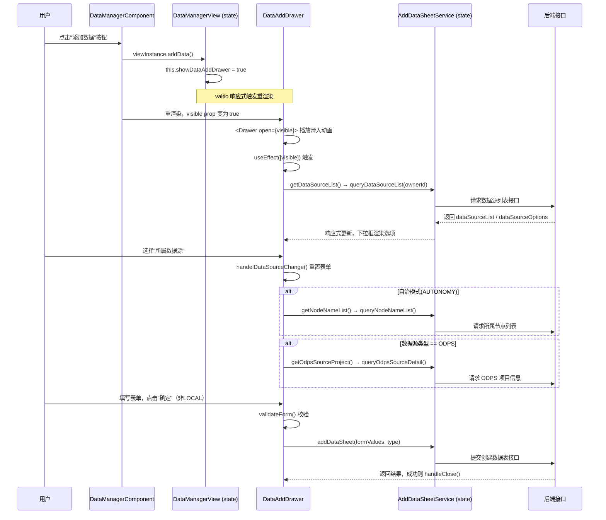
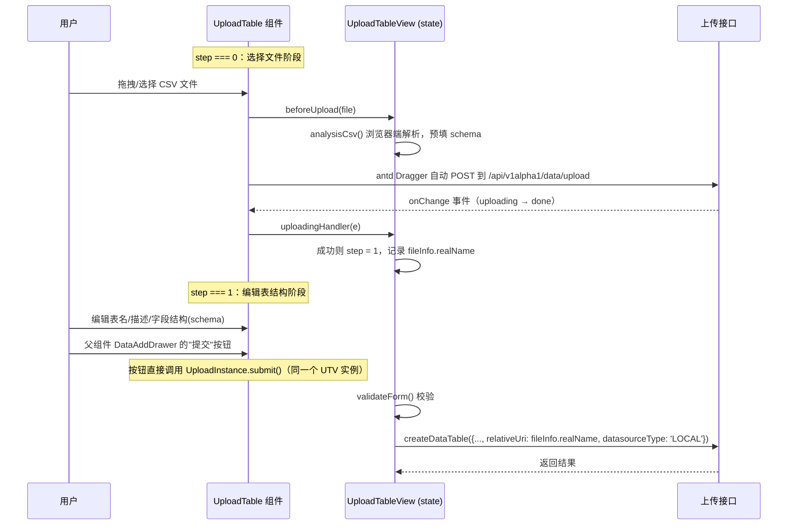

# 前端组件架构与父子关系说明

> 本文档描述 `apps/platform`（Secretpad 前端主应用）的整体组件架构，
> 重点梳理**路由 → 页面 → 功能模块 → 子组件**的父子关系，并给出关键模块的组件树图示。
>
> 技术栈：React + [umi](https://umijs.org/)（路由/构建） + [antd](https://ant.design/)（UI 组件库） + [valtio](https://github.com/pmndrs/valtio)（响应式状态管理）。

---

## 1. 整体分层架构



**分层职责说明：**

| 层级                       | 目录                             | 职责                                                                                                                                                                    |
| -------------------------- | -------------------------------- | ----------------------------------------------------------------------------------------------------------------------------------------------------------------------- |
| 路由配置                   | `apps/platform/config/routes.ts` | 声明 path、对应的 page 组件、以及包裹的 wrappers（鉴权/主题等）                                                                                                         |
| Wrappers（路由守卫）       | `src/wrappers/`                  | 登录态校验、部署模式校验（center/edge/p2p）、主题注入等，包裹在页面外层，校验不通过则重定向                                                                             |
| Layout（全局布局）         | `src/modules/layout/`            | 提供 `<Outlet />` 承载具体页面，以及顶部导航、Tab 管理布局（`HomeLayout`、`ManagementLayoutComponent`、`DagLayout` 等）                                                 |
| Pages（页面）              | `src/pages/*.tsx`                | umi 约定式路由页面，通常很薄——只负责拼装若干"功能模块"组件，自身很少写复杂业务逻辑                                                                                      |
| Modules（功能模块）        | `src/modules/<feature>/`         | 每个业务领域一个目录，内部包含 `*.view.tsx`（组件 + 对应的 `Model` 状态类）、`*.service.ts`（跨组件共享的业务逻辑/请求封装）、`component/` 子目录（该模块专属的子组件） |
| Components（全局共享组件） | `src/components/`                | 不属于任何单一业务模块，被多个 module 复用的通用 UI（如表格搜索、二次确认弹窗、权限包装器）                                                                             |

---

## 2. 状态管理机制：`Model` / `useModel` / `getModel`

文件：`src/util/valtio-helper.ts`



**关键结论：**

1. `Model` 基类的构造函数直接返回 `valtio.proxy(this)`，所以每个 `Model` 子类实例天生是响应式对象——修改任意字段（如 `this.showDataAddDrawer = true`）都会触发订阅了它的组件重新渲染。
2. `getModel(SomeModel)` 内部用 **`WeakMap`** 以"类"为 key 缓存实例——**同一个 `Model` 类在整个应用生命周期内只会被 `new` 一次**（除非页面刷新）。
3. `useModel(SomeModel)`：
   - 内部调用 `getModel` 拿到（或创建）单例；
   - 用 `useSnapshot(modelInstance)` 让当前组件订阅这个实例的变化（细粒度响应式，只有用到的字段变化才重渲染）；
   - 用 `useLayoutEffect` 在组件挂载/卸载时调用 `modelInstance.onViewMount()` / `onViewUnMount()`（如果子类重写了这两个生命周期方法）。
4. **父子组件共享状态的关键**：只要父组件和子组件都对同一个 `Model` 类调用了 `useModel(...)`，它们拿到的就是**同一个实例**——这是本项目里父子组件"隔代通信"（不经过 props 逐层传递）最常用的方式，比传统的 props drilling 或 Context 更简洁。

> 示例（本项目实际代码）：`data-manager.view.tsx` 里的 `DataManagerComponent` 和 `add-data.view.tsx` 里的 `DataAddDrawer` 都不需要通过 props 传递"上传状态"，而是各自调用 `useModel(UploadTableView)`，天然共享同一份数据。

---

## 3. 路由 → Layout → 页面 关系

来源：`apps/platform/config/routes.ts`

```mermaid
graph TD
    Root["/ (GlobalLayoutComponent<br/>modules/layout/layout.view.tsx)"]
    Root -->|"wrappers: theme-wrapper, login-auth"| Group1["主功能分组"]
    Root -->|"wrappers: theme-wrapper, login-auth, guide-auth"| Group2["/guide"]
    Login["/login (login.tsx)<br/>wrappers: theme-wrapper, login-wrapper"]

    Group1 -->|center-auth| P1["/ , /home → new-home.tsx"]
    Group1 -->|center-auth| P2["/dashboard → dashboard.tsx"]
    Group1 -->|center-auth| P3["/data-source → data-source.tsx"]
    Group1 -->|center-auth| P4["/data-source/:id → data-source-detail.tsx"]
    Group1 -->|center-auth| P5["/data-table → data-table.tsx"]
    Group1 -->|center-auth| P6["/nodes → nodes.tsx"]
    Group1 -->|center-auth| P7["/graphs → graphs.tsx"]
    Group1 -->|"p2p-center-auth + component-wrapper"| P8["/dag → dag.tsx"]
    Group1 -->|"p2p-center-auth + component-wrapper"| P9["/record → record.tsx"]
    Group1 -->|"p2p-center-auth + component-wrapper"| P10["/model-submission"]
    Group1 -->|"p2p-center-auth + component-wrapper"| P11["/periodic-task-detail"]
    Group1 -->|"edge-auth + component-wrapper"| P12["/node → new-node.tsx"]
    Group1 -->|"basic-node-auth + p2p-edge-center-auth"| P13["/my-node → my-node.tsx"]
    Group1 -->|"basic-node-auth + p2p-edge-center-auth + component-wrapper"| P14["/message → message.tsx"]
    Group1 -->|"basic-node-auth + p2p-login-auth"| P15["/edge → edge.tsx"]
    Group1 --> P16["/* → redirect /login"]

    Group2 --> P17["/guide → guide.tsx"]
```



**Wrappers 说明**（`src/wrappers/`）：包裹在页面外层的高阶组件，用于登录态/部署模式/权限校验，校验不通过会重定向或渲染兜底 UI，不参与业务渲染：

| Wrapper                                                       | 作用                                    |
| ------------------------------------------------------------- | --------------------------------------- |
| `theme-wrapper.tsx`                                           | 注入主题                                |
| `login-wrapper.tsx` / `login-auth.tsx` / `p2p-login-auth.tsx` | 登录页 / 登录态校验                     |
| `center-auth.tsx` / `edge-auth.tsx` / `basic-node-auth.tsx`   | 部署模式（center/edge）校验             |
| `p2p-center-auth.tsx` / `p2p-edge-center-auth.tsx`            | P2P 自治模式相关校验                    |
| `guide-auth.tsx`                                              | 新手引导页校验                          |
| `component-wrapper.tsx`                                       | 通用组件级包装（如 qiankun 微前端接入） |
| `node-auth.tsx`                                               | 节点相关权限校验                        |

---

## 4. 页面 → 功能模块 组件树（主要页面举例）

### 4.1 `/` `/home` → `new-home.tsx`（Center 部署模式首页）



共享状态：`HomeLayoutService`（子标题/背景样式）、`LoginService`（用户信息，决定是否展示"节点注册"Tab）。

### 4.2 `/node` → `new-node.tsx`（Edge 部署模式 / 单节点管理页）



共享状态：`HomeLayoutService`、`MessageService`、`NodeService`、`MyNodeService`（根据节点类型如 `tee` 节点动态过滤 Tab，如隐藏"数据源管理"）。

### 4.3 `/dag` → `dag.tsx`（工作流画布页）



> `dag` 相关模块内部依赖 `@secretflow/dag`（`packages/dag`）画布引擎包，逻辑较复杂，未在本文档展开，详见 `packages/dag/README.md`。

### 4.4 `/login` → `login.tsx`



---

## 5. 重点专题：数据管理（`data-manager`）完整组件树

这是本文档最核心、结合前序问答梳理最详尽的部分——从触发按钮到具体提交接口的完整父子关系。

### 5.1 组件树全貌



### 5.2 触发链路时序（点击"添加数据"按钮为例）



### 5.3 本地上传（LOCAL 类型）独立流程

`UploadTable` 走的是与上面完全不同的两阶段流程，且与 `DataAddDrawer` 通过**共享 `UploadTableView` 单例**（而非 props）联动：



### 5.4 各组件职责一览表

| 组件/文件                                                           | 是否有 `Model`                    | 职责                                                                                                                                      |
| ------------------------------------------------------------------- | --------------------------------- | ----------------------------------------------------------------------------------------------------------------------------------------- |
| `DataManagerComponent` / `DataManagerView`                          | ✅                                | 数据表列表展示、筛选、分页、删除、刷新状态；控制三个抽屉的显隐                                                                            |
| `DataAddDrawer` / `AddDataSheetService`                             | ✅                                | 添加数据主抽屉；管理"所属数据源/所属节点/ODPS 信息"拉取；非 LOCAL 类型的表单提交                                                          |
| `DataTableStructure` / `DataTableStructureService`                  | ✅                                | 字段结构（`features`/`schema`）编辑、行增删、字段校验错误展示（add-data 和 data-table-info 各有一份，职责不同：前者可编辑，后者只读展示） |
| `OdpsPartition`                                                     | ❌（无独立 Model，依赖父 `Form`） | ODPS 数据源的分区配置表单项                                                                                                               |
| `HttpQueryExample`                                                  | ❌                                | HTTP 数据源查询示例的静态说明展示                                                                                                         |
| `UploadTable` / `UploadTableView`                                   | ✅                                | 本地文件上传的两阶段流程（上传文件 → 编辑结构 → 提交建表），完全独立于 `AddDataSheetService`                                              |
| `DataTableAuth` / `DataTableAuthComponent` / `DatatableInfoService` | ✅                                | 数据表授权到项目的管理抽屉                                                                                                                |
| `DataTableInfoDrawer` / `DataTableInfoDrawerView`                   | ✅                                | 数据表详情只读展示抽屉（含结构、授权信息等 Tab）                                                                                          |

---

## 6. 共享组件（`src/components/`）

这些组件不属于任何单一业务模块，被多个 `modules/*` 复用：

| 组件                      | 文件                                                   | 作用                                                    | 使用方举例                                                              |
| ------------------------- | ------------------------------------------------------ | ------------------------------------------------------- | ----------------------------------------------------------------------- |
| `platform-wrapper.tsx`    | 导出 `Platform` 枚举、`hasAccess()`、`<AccessWrapper>` | 根据部署模式（P2P 自治/Center/Edge）判断是否展示某段 UI | `data-manager`、`add-data`、`upload-table` 等几乎所有涉及权限差异的模块 |
| `edge-wrapper-auth.tsx`   | `<EdgeAuthWrapper>`                                    | Edge 部署模式下的条件包装                               | `data-manager`（新手引导 Tour 的展示条件）                              |
| `comfirm-delete.tsx`      | `confirmDelete()`                                      | 通用二次确认删除弹窗                                    | `data-manager`（删除数据表前确认）                                      |
| `table-column-search.tsx` | `getColumnSearchProps()`                               | antd `Table` 列内搜索的通用配置生成器                   | `data-manager`（"所属节点"列搜索）                                      |
| `datatable-preview.tsx`   | 数据预览表格                                           | 数据表内容预览                                          | 多个数据相关模块                                                        |

---

## 7. 目录与命名约定总结

```
apps/platform/src/
├── pages/                      # umi 约定式路由页面（薄壳层，负责拼装 modules）
├── modules/
│   └── <feature>/               # 一个业务领域一个目录
│       ├── <feature>.view.tsx   # 主组件 + `export class XxxView extends Model`（状态类，可选）
│       ├── <feature>.service.ts # 跨组件共享的业务逻辑/接口封装（可选，也可直接写在 Model 里）
│       └── component/           # 该模块专属、不对外复用的子组件
│           └── <sub-feature>/
│               └── <sub>.view.tsx
├── components/                  # 全局共享、跨 module 复用的通用组件
├── wrappers/                    # 路由级高阶包装（鉴权/主题等）
└── util/
    └── valtio-helper.ts         # Model / useModel / getModel 状态管理基础设施
```

**父子关系判定原则（贯穿本项目）：**

1. **JSX 渲染关系** 决定组件树的父子——哪个组件在 `return (...)` 里渲染了另一个组件，就是父子关系（可用全局搜索该组件名确认，如 `grep "<DataAddDrawer"`）。
2. **Props** 是父 → 子单向数据流的主要方式，子组件通过父传入的回调（如 `onClose`）反向"请求"父组件修改状态，而不能直接修改父组件的 state。
3. **`useModel(SomeModel)` 共享同一单例** 是本项目里父子组件（甚至非直接父子的跨层级组件）共享状态的另一种方式，效果类似全局单例 Store，不受组件树位置限制。
